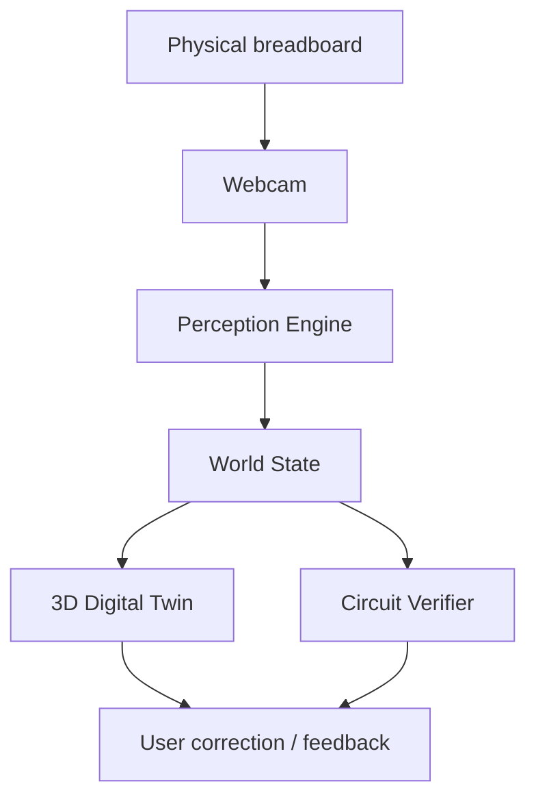
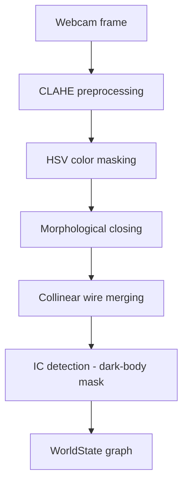

# BuildLens — AI Co-Pilot for Breadboard Debugging


-blue)


**Local-first, 3D-augmented assistant for physical electronics prototyping.**

BuildLens watches a breadboard through a webcam, detects wires, ICs, and pins using computer vision, and builds a live digital twin of the circuit — with the goal of catching wiring mistakes before they cost you an hour of debugging. It runs entirely locally: no cloud CV service, no external API calls, camera data never leaves the machine.

> Demo video and screenshots will be added once the 3D digital twin is functional. See [Project Status](#project-status) for what is currently running.

---

## The Problem

Hardware labs lose more time to small, mechanical mistakes than to hard conceptual ones. A breadboard circuit that "should work" often doesn't because of something trivial: a jumper wire one row off, an LED with cathode and anode swapped, a connection that isn't fully seated. None of these is hard to fix once identified — the expensive part is finding them: tracing wires with a multimeter, cross-checking a schematic, and re-verifying connections one at a time.

BuildLens is an attempt to shorten that loop: point a webcam at the board, let computer vision reconstruct what is actually connected, and flag mismatches before significant debugging time is spent finding them by hand.

---

## Features

| Feature | Status | Description |
|---|---|---|
| Real-time perception | In progress, tuning | Detects pins, wires (by colour), and ICs via OpenCV — CLAHE preprocessing, HSV masking, morphological closing, collinear wire merging |
| Interactive calibration tool | Built | `calibrate_all.py` — slider-based tuning of HSV ranges, morphology kernel, and pin/IC thresholds, with live preview saved to disk |
| 3D digital twin | Planned | Interactive breadboard model in React Three Fibre, synced to live detections |
| Deterministic verifier | Planned | Compares the detected circuit against a user-provided spec using graph comparison, not LLM judgment |
| Optional LLM semantic mapping | Planned | Ollama-based labelling (e.g., "IC1 VCC") as a non-blocking enhancement, never required for core function |
| Local and private by design | True today | No cloud dependency, no external API keys, camera stream stays on-device |

---

## How It Works



Computer vision provides an initial interpretation of the circuit; the user can correct anything it gets wrong before verification runs. This human-in-the-loop step matters because breadboard CV is genuinely difficult — glare, occlusion, and similarly coloured wires all cause misreads. Hiding that uncertainty would make the tool worse than manual inspection, so confidence and ambiguity are surfaced rather than concealed.

### Perception Pipeline (Current)



---

## Project Status

| Phase | Description | Status |
|---|---|---|
| 0 | Project scaffolding | Complete |
| 0.5 | Perception test harness | Complete |
| 1 | Live webcam bridge | Complete |
| 2 | 2D perception engine (pins, wires, ICs) | Mostly built, tuning in progress |
| 3 | Spatial calibration (ArUco / homography) | Planned |
| 4 | 3D digital twin | Planned |
| 5 | Interactive correction | Planned |
| 6 | Semantic mapping and verification | Planned |
| 7 | Feedback overlays | Planned |
| 8 | Ambiguity handling | Planned |
| 9 | Polish and packaging | Planned |

**Current state:** The webcam-to-backend pipeline works end-to-end, and the 2D perception engine — pin detection, HSV-based wire detection, wire merging, and IC detection — is implemented and mostly working, but detection accuracy still depends heavily on per-environment calibration (lighting, camera, wire colors). The `calibrate_all.py` tool exists specifically to make that tuning fast rather than trial-and-error. Spatial calibration and everything downstream (3D twin, correction, verification) has not been built yet.

---

## Tech Stack

| Layer | Technology |
|---|---|
| Backend | Python 3.10+, FastAPI, OpenCV, NumPy |
| Frontend | Next.js 14, React, React Three Fiber, TypeScript |
| Optional AI | Ollama (local LLM, for semantic labeling later) |
| Orchestration | Docker Compose (optional) |

The core CV and verification pipeline is designed to remain fully functional without the optional AI component.

---

## Repository Structure

```text
buildlens/
├── backend/
│   ├── main.py               FastAPI + WebSocket server
│   ├── perception.py         Perception engine (CLAHE + HSV + morphology)
│   ├── wire_merger.py        Collinear wire merging (PCA-based)
│   ├── ic_pin_detector.py    IC detection + pin search
│   ├── calibrate_all.py      Interactive calibration tool (sliders + live preview)
│   ├── models.py             WorldState Pydantic schemas
│   ├── detection_buffer.py   Temporal smoothing across frames
│   ├── components.json       IC database (pinouts, functions)
│   └── requirements.txt
├── frontend/
│   ├── app/page.tsx          Webcam capture + (future) 3D twin
│   ├── package.json
│   └── tsconfig.json
├── test_data/                Sample frames and saved overlays
├── docker-compose.yml
└── README.md
```

---

## Getting Started

**Requirements:** Python 3.10+, Node.js 18+, a webcam. Docker is optional.

```bash
git clone https://github.com/# BuildLens — AI Co-Pilot for Breadboard Debugging


-blue)


**Local-first, 3D-augmented assistant for physical electronics prototyping.**

BuildLens watches a breadboard through a webcam, detects wires, ICs, and pins using computer vision, and builds a live digital twin of the circuit — with the goal of catching wiring mistakes before they cost you an hour of debugging. It runs entirely locally: no cloud CV service, no external API calls, camera data never leaves the machine.

> Demo video and screenshots will be added once the 3D digital twin is functional. See [Project Status](#project-status) for what is currently running.

---

## The Problem

Hardware labs lose more time to small, mechanical mistakes than to hard conceptual ones. A breadboard circuit that "should work" often doesn't because of something trivial: a jumper wire one row off, an LED with cathode and anode swapped, a connection that isn't fully seated. None of these are hard to fix once identified — the expensive part is finding them: tracing wires with a multimeter, cross-checking a schematic, and re-verifying connections one at a time.

BuildLens is an attempt to shorten that loop: point a webcam at the board, let computer vision reconstruct what is actually connected, and flag mismatches before significant debugging time is spent finding them by hand.

---

## Features

| Feature | Status | Description |
|---|---|---|
| Real-time perception | In progress, tuning | Detects pins, wires (by color), and ICs via OpenCV — CLAHE preprocessing, HSV masking, morphological closing, collinear wire merging |
| Interactive calibration tool | Built | `calibrate_all.py` — slider-based tuning of HSV ranges, morphology kernel, and pin/IC thresholds, with live preview saved to disk |
| 3D digital twin | Planned | Interactive breadboard model in React Three Fiber, synced to live detections |
| Deterministic verifier | Planned | Compares the detected circuit against a user-provided spec using graph comparison, not LLM judgment |
| Optional LLM semantic mapping | Planned | Ollama-based labeling (e.g., "IC1 VCC") as a non-blocking enhancement, never required for core function |
| Local and private by design | True today | No cloud dependency, no external API keys, camera stream stays on-device |

---

## How It Works


Computer vision provides an initial interpretation of the circuit; the user can correct anything it gets wrong before verification runs. This human-in-the-loop step matters because breadboard CV is genuinely difficult — glare, occlusion, and similar-colored wires all cause misreads. Hiding that uncertainty would make the tool worse than manual inspection, so confidence and ambiguity are surfaced rather than concealed.

### Perception Pipeline (Current)


---

## Project Status

| Phase | Description | Status |
|---|---|---|
| 0 | Project scaffolding | Complete |
| 0.5 | Perception test harness | Complete |
| 1 | Live webcam bridge | Complete |
| 2 | 2D perception engine (pins, wires, ICs) | Mostly built, tuning in progress |
| 3 | Spatial calibration (ArUco / homography) | Planned |
| 4 | 3D digital twin | Planned |
| 5 | Interactive correction | Planned |
| 6 | Semantic mapping and verification | Planned |
| 7 | Feedback overlays | Planned |
| 8 | Ambiguity handling | Planned |
| 9 | Polish and packaging | Planned |

**Current state:** the webcam-to-backend pipeline works end-to-end, and the 2D perception engine — pin detection, HSV-based wire detection, wire merging, and IC detection — is implemented and mostly working, but detection accuracy still depends heavily on per-environment calibration (lighting, camera, wire colors). The `calibrate_all.py` tool exists specifically to make that tuning fast rather than trial-and-error. Spatial calibration and everything downstream (3D twin, correction, verification) has not been built yet.

---

## Tech Stack

| Layer | Technology |
|---|---|
| Backend | Python 3.10+, FastAPI, OpenCV, NumPy |
| Frontend | Next.js 14, React, React Three Fiber, TypeScript |
| Optional AI | Ollama (local LLM, for semantic labeling later) |
| Orchestration | Docker Compose (optional) |

The core CV and verification pipeline is designed to remain fully functional without the optional AI component.

---

## Repository Structure

```text
buildlens/
├── backend/
│   ├── main.py               FastAPI + WebSocket server
│   ├── perception.py         Perception engine (CLAHE + HSV + morphology)
│   ├── wire_merger.py        Collinear wire merging (PCA-based)
│   ├── ic_pin_detector.py    IC detection + pin search
│   ├── calibrate_all.py      Interactive calibration tool (sliders + live preview)
│   ├── models.py             WorldState Pydantic schemas
│   ├── detection_buffer.py   Temporal smoothing across frames
│   ├── components.json       IC database (pinouts, functions)
│   └── requirements.txt
├── frontend/
│   ├── app/page.tsx          Webcam capture + (future) 3D twin
│   ├── package.json
│   └── tsconfig.json
├── test_data/                Sample frames and saved overlays
├── docker-compose.yml
└── README.md
```

---

## Getting Started

**Requirements:** Python 3.10+, Node.js 18+, a webcam. Docker is optional.

```bash
git clone https://github.com/Vkkeswani/buildlens.git
cd buildlens

# Backend
cd backend
python -m venv .venv
source .venv/bin/activate       # Windows: .venv\Scripts\activate
pip install -r requirements.txt

# Frontend
cd ../frontend
npm install
```

### Running the System

**Option A — Docker Compose**
```bash
docker-compose up
```

**Option B — Manual (two terminals)**
```bash
# Terminal 1 — backend
cd backend && source .venv/bin/activate
uvicorn main:app --reload --host 0.0.0.0 --port 8000

# Terminal 2 — frontend
cd frontend && npm run dev -- --port 3000
```

Open `http://localhost:3000`, allow camera access, and use "Pause & Send" to send a frame to the backend for detection.

---

## Calibration

Detection accuracy depends on lighting, webcam, and wire colors, and needs to be tuned per setup. Use the calibration tool:

```bash
cd backend
source .venv/bin/activate
python calibrate_all.py
```

- Adjust HSV sliders until each wire color shows as a clean, solid mask
- Adjust the morphology kernel size to close gaps in broken wire segments (try 9, 11, 15)
- Adjust dark-value threshold to detect IC bodies
- Adjust metal value/saturation thresholds to detect pin tips
- Press `S` to save `calibration.json`, `Esc` to exit

The backend loads `calibration.json` automatically on startup. This step is required at the current stage — without it, detection quality on a new setup will be inconsistent, which reflects the current maturity of the calibration pipeline rather than a defect.

---

## Testing the Perception Pipeline

Detection can be run on a static image without a live webcam:

```bash
cd backend
source .venv/bin/activate
python perception_test.py ../test_data/breadboard_live.png
```

This prints a detection summary (pin, wire, and IC counts) and saves an annotated overlay to `test_data/overlay_annotated.jpg` for visual inspection.

---

## World State

```text
WorldState
├── Pins
├── WireEndpoints
├── Wires
├── ICs
├── Calibration
└── CorrectionHistory
```

Every detected object carries position, confidence, and its relationships to others, so the same state can eventually drive both the 3D view and the verifier without duplicating logic. `Calibration` and `CorrectionHistory` are defined in the schema but not yet populated by working code — they are placeholders for Phases 3 and 5.

---

## Design Principles

**Local-first.** No cloud CV service or external API is required for the core pipeline.

**Human in the loop.** CV will not always be reliable — occlusion, glare, and similar-colored wires are expected failure modes. The interface is designed to surface uncertainty rather than hide it.

**Deterministic verification.** Circuit verification, once built, will be a graph comparison against expected structure rather than an LLM judgment call.

**Topological over geographic.** The system is concerned with which points are connected, not only their pixel coordinates.

---

## Known Limitations

- **Lighting sensitivity** — HSV ranges need re-tuning per environment; use `calibrate_all.py`
- **Wire fragmentation** — partially addressed with morphological closing and collinear merging, but long or curved wires can still require tuning
- **IC detection** — depends on a dark-body mask; currently tuned for DIP-8 and DIP-14 packages
- **No spatial calibration yet** — coordinates are pixel-space only; there is no camera-to-real-world mapping until Phase 3
- **No 3D visualization, correction, or verification yet** — these are designed but not implemented

---

## Roadmap

Phases run sequentially: scaffolding, perception test harness, webcam bridge, 2D perception, spatial calibration, 3D digital twin, interactive correction, semantic mapping and verification, feedback overlays, ambiguity handling, polish. The immediate focus is completing calibration and tuning on Phase 2 before starting spatial calibration (Phase 3).

---

## Contributing

This is currently a solo work-in-progress project developed as part of independent study. Issues, suggestions, and bug reports are welcome — feel free to open an issue if something is unclear or broken.

## License

MIT — see [LICENSE](LICENSE). Add a `LICENSE` file to the repository root if one is not already present.

---

## Project Goal

Point a webcam at a breadboard, obtain an accurate digital representation of the circuit, correct whatever the vision system gets wrong, and determine — deterministically — whether the result matches the intended design. The objective is not a demonstration of AI capability, but a reduction in the time spent locating a flipped LED or a missing jumper wire./buildlens.git
cd buildlens

# Backend
cd backend
python -m venv .venv
source .venv/bin/activate       # Windows: .venv\Scripts\activate
pip install -r requirements.txt

# Frontend
cd ../frontend
npm install
```

### Running the System

**Option A — Docker Compose**
```bash
docker-compose up
```

**Option B — Manual (two terminals)**
```bash
# Terminal 1 — backend
cd backend && source .venv/bin/activate
uvicorn main:app --reload --host 0.0.0.0 --port 8000

# Terminal 2 — frontend
cd frontend && npm run dev -- --port 3000
```

Open `http://localhost:3000`, allow camera access, and use "Pause & Send" to send a frame to the backend for detection.

---

## Calibration

Detection accuracy depends on lighting, webcam, and wire colors, and needs to be tuned per setup. Use the calibration tool:

```bash
cd backend
source .venv/bin/activate
python calibrate_all.py
```

- Adjust HSV sliders until each wire color shows as a clean, solid mask
- Adjust the morphology kernel size to close gaps in broken wire segments (try 9, 11, 15)
- Adjust dark-value threshold to detect IC bodies
- Adjust metal value/saturation thresholds to detect pin tips
- Press `S` to save `calibration.json`, `Esc` to exit

The backend loads `calibration.json` automatically on startup. This step is required at the current stage — without it, detection quality on a new setup will be inconsistent, which reflects the current maturity of the calibration pipeline rather than a defect.

---

## Testing the Perception Pipeline

Detection can be run on a static image without a live webcam:

```bash
cd backend
source .venv/bin/activate
python perception_test.py ../test_data/breadboard_live.png
```

This prints a detection summary (pin, wire, and IC counts) and saves an annotated overlay to `test_data/overlay_annotated.jpg` for visual inspection.

---

## World State

```text
WorldState
├── Pins
├── WireEndpoints
├── Wires
├── ICs
├── Calibration
└── CorrectionHistory
```

Every detected object carries position, confidence, and its relationships to others, so the same state can eventually drive both the 3D view and the verifier without duplicating logic. `Calibration` and `CorrectionHistory` are defined in the schema but not yet populated by working code — they are placeholders for Phases 3 and 5.

---

## Design Principles

**Local-first.** No cloud CV service or external API is required for the core pipeline.

**Human in the loop.** CV will not always be reliable — occlusion, glare, and similar-colored wires are expected failure modes. The interface is designed to surface uncertainty rather than hide it.

**Deterministic verification.** Circuit verification, once built, will be a graph comparison against expected structure rather than an LLM judgment call.

**Topological over geographic.** The system is concerned with which points are connected, not only their pixel coordinates.

---

## Known Limitations

- **Lighting sensitivity** — HSV ranges need re-tuning per environment; use `calibrate_all.py`
- **Wire fragmentation** — partially addressed with morphological closing and collinear merging, but long or curved wires can still require tuning
- **IC detection** — depends on a dark-body mask; currently tuned for DIP-8 and DIP-14 packages
- **No spatial calibration yet** — coordinates are pixel-space only; there is no camera-to-real-world mapping until Phase 3
- **No 3D visualization, correction, or verification yet** — these are designed but not implemented

---

## Roadmap

Phases run sequentially: scaffolding, perception test harness, webcam bridge, 2D perception, spatial calibration, 3D digital twin, interactive correction, semantic mapping and verification, feedback overlays, ambiguity handling, polish. The immediate focus is completing calibration and tuning on Phase 2 before starting spatial calibration (Phase 3).

---

## Contributing

This is currently a solo work-in-progress project developed as part of independent study. Issues, suggestions, and bug reports are welcome — feel free to open an issue if something is unclear or broken.

## License

MIT — see [LICENSE](LICENSE). Add a `LICENSE` file to the repository root if one is not already present.

---

## Project Goal

Point a webcam at a breadboard, obtain an accurate digital representation of the circuit, correct whatever the vision system gets wrong, and determine — deterministically — whether the result matches the intended design. The objective is not a demonstration of AI capability, but a reduction in the time spent locating a flipped LED or a missing jumper wire.
